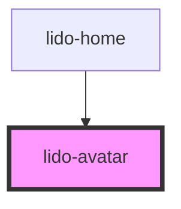

# lido-avatar

<!-- Auto Generated Below -->

## Properties

| Property       | Attribute       | Description                                                                                                             | Type      | Default  |
| -------------- | --------------- | ----------------------------------------------------------------------------------------------------------------------- | --------- | -------- |
| `ariaHidden`   | `aria-hidden`   | The ARIA hidden attribute of the container. Used for accessibility to hide the element.                                 | `string`  | `''`     |
| `ariaLabel`    | `aria-label`    | The ARIA label of the container. Used for accessibility to indicate the purpose of the element.                         | `string`  | `''`     |
| `audio`        | `audio`         | Audio file URL or identifier for sound that will be associated with the column.                                         | `string`  | `''`     |
| `bgColor`      | `bg-color`      | The background color of the column (CSS color value, e.g., '#FFFFFF', 'blue').                                          | `string`  | `''`     |
| `delayVisible` | `delay-visible` | Delay in milliseconds to make the cell visible after mount.                                                             | `string`  | `''`     |
| `height`       | `height`        | The height of the column component (CSS value, e.g., '100px', '50%').                                                   | `string`  | `''`     |
| `id`           | `id`            | The unique identifier for the column component.                                                                         | `string`  | `''`     |
| `onCorrect`    | `on-correct`    | Event handler for a Correct matching action, which can be used to hide the column or trigger other custom logic.        | `string`  | `''`     |
| `onEntry`      | `on-entry`      | Event handler for when the column is entered, which can be used to initiate specific behaviors on entry.                | `string`  | `''`     |
| `onInCorrect`  | `on-in-correct` | Event handler for an Incorrect matching action, which can be used to trigger custom logic when the action is incorrect. | `string`  | `''`     |
| `onTouch`      | `on-touch`      | Event handler for a touch event, where a custom function can be triggered when the column is touched.                   | `string`  | `''`     |
| `src`          | `src`           | Source URL of the Rive (.riv) file                                                                                      | `string`  | `''`     |
| `tabIndex`     | `tab-index`     | The tab index value, used to set the tab order of the column for keyboard navigation.                                   | `number`  | `0`      |
| `type`         | `type`          | Defines the type of the column, which can be used for styling or specific logic handling.                               | `string`  | `''`     |
| `value`        | `value`         | The value associated with the column component. Typically used for internal logic.                                      | `string`  | `''`     |
| `visible`      | `visible`       | A boolean that controls whether the column is visible (`true`) or hidden (`false`).                                     | `boolean` | `false`  |
| `width`        | `width`         | The width of the column component (CSS value, e.g., '100px', '50%').                                                    | `string`  | `'auto'` |
| `x`            | `x`             | The x-coordinate (left position) of the column within its container (CSS value, e.g., '10px', '5vw').                   | `string`  | `'0px'`  |
| `y`            | `y`             | The y-coordinate (top position) of the column within its container (CSS value, e.g., '10px', '5vh').                    | `string`  | `'0px'`  |
| `z`            | `z`             | The z-index of the column to control stacking order.                                                                    | `string`  | `'0'`    |

## Dependencies

### Used by

 - [lido-home](../home)

### Graph

----------------------------------------------

*Built with [StencilJS](https://stenciljs.com/)*
