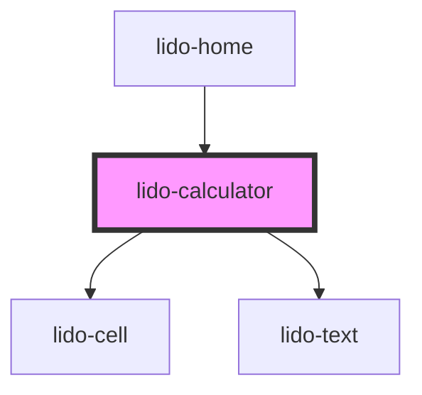

# lido-calculator

<!-- Auto Generated Below -->

## Properties

| Property    | Attribute   | Description                                                                                 | Type                | Default                                                                                                                        |
| ----------- | ----------- | ------------------------------------------------------------------------------------------- | ------------------- | ------------------------------------------------------------------------------------------------------------------------------ |
| `bgColor`   | `bg-color`  | Background color for the calculator container                                               | `string`            | `'#60DADA'`                                                                                                                    |
| `height`    | `height`    | Height of the calculator component (default: '711px')                                       | `string`            | `'711px'`                                                                                                                      |
| `objective` | `objective` | Objective or identifier for activity-based logic or validation                              | `string`            | `''`                                                                                                                           |
| `onEntry`   | `on-entry`  | Code or actions to execute when the component is first rendered                             | `string`            | `''`                                                                                                                           |
| `penIcon`   | `pen-icon`  | Icon URL for the pen image shown on the calculator UI                                       | `string`            | `"https://aeakbcdznktpsbrfsgys.supabase.co/storage/v1/object/public/template-assets/calculator/Pen--Streamline-Solar%201.svg"` |
| `visible`   | `visible`   | Controls component visibility. Accepts boolean (`true`/`false`) or string ("true"/"false"). | `boolean \| string` | `false`                                                                                                                        |
| `width`     | `width`     | Width of the calculator component (default: '479px')                                        | `string`            | `'479px'`                                                                                                                      |
| `x`         | `x`         | X-position of the calculator (can be px, %, etc.)                                           | `string`            | `'0px'`                                                                                                                        |
| `y`         | `y`         | Y-position of the calculator (can be px, %, etc.)                                           | `string`            | `'0px'`                                                                                                                        |

## Events

| Event  | Description                                                                 | Type                   |
| ------ | --------------------------------------------------------------------------- | ---------------------- |
| `onOk` | Event emitted when user confirms or completes an action (e.g., pressing OK) | `CustomEvent<boolean>` |

## Dependencies

### Used by

 - [lido-home](../home)

### Depends on

- [lido-cell](../cell)
- [lido-text](../text)

### Graph

----------------------------------------------

*Built with [StencilJS](https://stenciljs.com/)*
