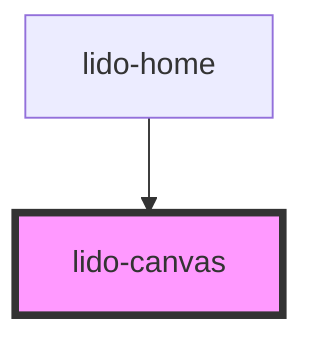

# lido-canvas

<!-- Auto Generated Below -->

## Properties

| Property  | Attribute  | Description | Type     | Default     |
| --------- | ---------- | ----------- | -------- | ----------- |
| `bgImage` | `bg-image` |             | `string` | `undefined` |
| `height`  | `height`   |             | `string` | `'700px'`   |
| `onEntry` | `on-entry` |             | `string` | `''`        |
| `width`   | `width`    |             | `string` | `'800px'`   |
| `x`       | `x`        |             | `string` | `'0px'`     |
| `y`       | `y`        |             | `string` | `'0px'`     |

## Dependencies

### Used by

 - [lido-home](../home)

### Graph

----------------------------------------------

*Built with [StencilJS](https://stenciljs.com/)*
