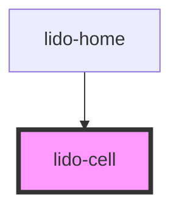

# lido-cell

<!-- Auto Generated Below -->

## Properties

| Property              | Attribute               | Description                                                                                                                                                                                                                                                                                                                                                                                                               | Type      | Default     |
| --------------------- | ----------------------- | ------------------------------------------------------------------------------------------------------------------------------------------------------------------------------------------------------------------------------------------------------------------------------------------------------------------------------------------------------------------------------------------------------------------------- | --------- | ----------- |
| `ariaHidden`          | `aria-hidden`           | The ARIA hidden attribute of the container. Used for accessibility to hide the element.                                                                                                                                                                                                                                                                                                                                   | `string`  | `undefined` |
| `ariaLabel`           | `aria-label`            | The ARIA label of the container. Used for accessibility to indicate the purpose of the element.                                                                                                                                                                                                                                                                                                                           | `string`  | `undefined` |
| `audio`               | `audio`                 | Audio file URL or identifier for sound that will be associated with the column.                                                                                                                                                                                                                                                                                                                                           | `string`  | `undefined` |
| `bgColor`             | `bg-color`              | The background color of the column (CSS color value, e.g., '#FFFFFF', 'blue').                                                                                                                                                                                                                                                                                                                                            | `string`  | `undefined` |
| `boxShadow`           | `box-shadow`            | Applies a CSS box-shadow to the component. Accepts any valid CSS box-shadow value. Example: "0px 4px 10px rgba(0, 0, 0, 0.1)"                                                                                                                                                                                                                                                                                             | `string`  | `undefined` |
| `childElementsLength` | `child-elements-length` | The number of child elements that should be displayed inside the row. This value is dynamically adjusted based on `minLength` and `maxLength`.                                                                                                                                                                                                                                                                            | `number`  | `undefined` |
| `flow`                | `flow`                  | Determines the layout behavior of the component's children.  - `wrap`: Applies a grid layout to the children, allowing them to wrap automatically in a grid format. - `flex`: Applies a flex layout with wrapping behavior (`flex-wrap`). - `col`: Arranges children in a single column using a vertical flex direction. - `row`: Arranges children in a single row using a horizontal flex direction.  Default: `'wrap'` | `string`  | `'wrap'`    |
| `height`              | `height`                | The height of the column component (CSS value, e.g., '100px', '50%').                                                                                                                                                                                                                                                                                                                                                     | `string`  | `undefined` |
| `id`                  | `id`                    | The unique identifier for the column component.                                                                                                                                                                                                                                                                                                                                                                           | `string`  | `undefined` |
| `maxLength`           | `max-length`            | The maximum number of child elements that can be displayed inside the row. If `childElementsLength` exceeds this value, excess elements will be hidden.                                                                                                                                                                                                                                                                   | `number`  | `undefined` |
| `minLength`           | `min-length`            | The minimum number of child elements that must be displayed inside the row. If `childElementsLength` is less than this value, additional elements may be shown to meet this minimum.                                                                                                                                                                                                                                      | `number`  | `undefined` |
| `onCorrect`           | `on-correct`            | Event handler for a Correct matching action, which can be used to hide the column or trigger other custom logic.                                                                                                                                                                                                                                                                                                          | `string`  | `undefined` |
| `onEntry`             | `on-entry`              | Event handler for when the column is entered, which can be used to initiate specific behaviors on entry.                                                                                                                                                                                                                                                                                                                  | `string`  | `undefined` |
| `onInCorrect`         | `on-in-correct`         | Event handler for an Incorrect matching action, which can be used to trigger custom logic when the action is incorrect.                                                                                                                                                                                                                                                                                                   | `string`  | `undefined` |
| `onTouch`             | `on-touch`              | Event handler for a touch event, where a custom function can be triggered when the column is touched.                                                                                                                                                                                                                                                                                                                     | `string`  | `undefined` |
| `tabIndex`            | `tab-index`             | The tab index value, used to set the tab order of the column for keyboard navigation.                                                                                                                                                                                                                                                                                                                                     | `number`  | `undefined` |
| `type`                | `type`                  | Defines the type of the column, which can be used for styling or specific logic handling.                                                                                                                                                                                                                                                                                                                                 | `string`  | `undefined` |
| `value`               | `value`                 | The value associated with the column component. Typically used for internal logic.                                                                                                                                                                                                                                                                                                                                        | `string`  | `undefined` |
| `visible`             | `visible`               | A boolean that controls whether the column is visible (`true`) or hidden (`false`).                                                                                                                                                                                                                                                                                                                                       | `boolean` | `undefined` |
| `width`               | `width`                 | The width of the column component (CSS value, e.g., '100px', '50%').                                                                                                                                                                                                                                                                                                                                                      | `string`  | `undefined` |
| `x`                   | `x`                     | The x-coordinate (left position) of the column within its container (CSS value, e.g., '10px', '5vw').                                                                                                                                                                                                                                                                                                                     | `string`  | `undefined` |
| `y`                   | `y`                     | The y-coordinate (top position) of the column within its container (CSS value, e.g., '10px', '5vh').                                                                                                                                                                                                                                                                                                                      | `string`  | `undefined` |
| `z`                   | `z`                     | The z-index of the column to control stacking order.                                                                                                                                                                                                                                                                                                                                                                      | `string`  | `undefined` |

## Dependencies

### Used by

 - [lido-home](../home)

### Graph

----------------------------------------------

*Built with [StencilJS](https://stenciljs.com/)*
