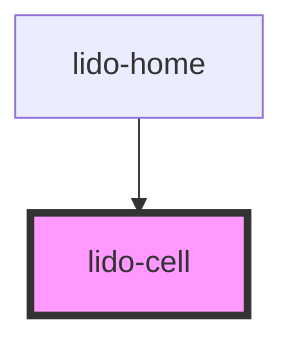

# lido-cell

<!-- Auto Generated Below -->

## Properties

| Property              | Attribute               | Description                                                                                                                                                                                                                                                                                                                                                                                                                                                                                                                                                                                                                     | Type     | Default   |
| --------------------- | ----------------------- | ------------------------------------------------------------------------------------------------------------------------------------------------------------------------------------------------------------------------------------------------------------------------------------------------------------------------------------------------------------------------------------------------------------------------------------------------------------------------------------------------------------------------------------------------------------------------------------------------------------------------------- | -------- | --------- |
| `ariaHidden`          | `aria-hidden`           | The ARIA hidden attribute of the container. Used for accessibility to hide the element.                                                                                                                                                                                                                                                                                                                                                                                                                                                                                                                                         | `string` | `''`      |
| `ariaLabel`           | `aria-label`            | The ARIA label of the container. Used for accessibility to indicate the purpose of the element.                                                                                                                                                                                                                                                                                                                                                                                                                                                                                                                                 | `string` | `''`      |
| `audio`               | `audio`                 | Audio file URL or identifier for sound that will be associated with the column.                                                                                                                                                                                                                                                                                                                                                                                                                                                                                                                                                 | `string` | `''`      |
| `bgColor`             | `bg-color`              | The background color of the column (CSS color value, e.g., '#FFFFFF', 'blue').                                                                                                                                                                                                                                                                                                                                                                                                                                                                                                                                                  | `string` | `''`      |
| `borderRadius`        | `border-radius`         | CSS filter to apply border radius to the image. Example: '10px' for  images.                                                                                                                                                                                                                                                                                                                                                                                                                                                                                                                                                    | `string` | `'0px'`   |
| `childElementsLength` | `child-elements-length` | The number of child elements that should be displayed inside the row. This value is dynamically adjusted based on `minLength` and `maxLength`.                                                                                                                                                                                                                                                                                                                                                                                                                                                                                  | `number` | `9999`    |
| `flexDirection`       | `flex-direction`        | CSS flex direction for the component, which can be used to control the layout of child elements. Accepts values like 'row', 'column', etc.                                                                                                                                                                                                                                                                                                                                                                                                                                                                                      | `string` | `''`      |
| `gap`                 | `gap`                   | The gap between child elements inside the column (CSS value, e.g., '10px', '5px 10px'). This is applicable when the layout is set to `wrap` or `flex`.                                                                                                                                                                                                                                                                                                                                                                                                                                                                          | `string` | `'0'`     |
| `height`              | `height`                | The height of the column component (CSS value, e.g., '100px', '50%').                                                                                                                                                                                                                                                                                                                                                                                                                                                                                                                                                           | `string` | `'auto'`  |
| `id`                  | `id`                    | The unique identifier for the column component.                                                                                                                                                                                                                                                                                                                                                                                                                                                                                                                                                                                 | `string` | `''`      |
| `layout`              | `layout`                | Determines the layout behavior of the component's children.  - `wrap`: Applies a grid layout to the children, allowing them to wrap automatically in a grid format. - `flex`: Applies a flex layout with wrapping behavior (`flex-wrap`). - `col`: Arranges children in a single column using a vertical flex direction. - `row`: Arranges children in a single row using a horizontal flex direction. - `pos`: Applies absolute positioning to children, allowing manual placement using `x` and `y` values. - `random`: Positions child elements randomly within the container using absolute positioning.  Default: `'wrap'` | `string` | `'wrap'`  |
| `margin`              | `margin`                | CSS margin value applied to each child element inside the container. Accepts standard CSS margin formats (e.g., '10px', '5px 10px', etc.).                                                                                                                                                                                                                                                                                                                                                                                                                                                                                      | `string` | `''`      |
| `maxDrops`            | `max-drops`             | The Maximum number of drag elements that can be dropped inside the Drop element.                                                                                                                                                                                                                                                                                                                                                                                                                                                                                                                                                | `number` | `1`       |
| `maxLength`           | `max-length`            | The maximum number of child elements that can be displayed inside the row. If `childElementsLength` exceeds this value, excess elements will be hidden.                                                                                                                                                                                                                                                                                                                                                                                                                                                                         | `number` | `9999`    |
| `minDrops`            | `min-drops`             | The minimum number of drag elements that must be dropped inside the Drop element.                                                                                                                                                                                                                                                                                                                                                                                                                                                                                                                                               | `number` | `1`       |
| `minLength`           | `min-length`            | The minimum number of child elements that must be displayed inside the row. If `childElementsLength` is less than this value, additional elements may be shown to meet this minimum.                                                                                                                                                                                                                                                                                                                                                                                                                                            | `number` | `0`       |
| `onCorrect`           | `on-correct`            | Event handler for a Correct matching action, which can be used to hide the column or trigger other custom logic.                                                                                                                                                                                                                                                                                                                                                                                                                                                                                                                | `string` | `''`      |
| `onEntry`             | `on-entry`              | Event handler for when the column is entered, which can be used to initiate specific behaviors on entry.                                                                                                                                                                                                                                                                                                                                                                                                                                                                                                                        | `string` | `''`      |
| `onInCorrect`         | `on-in-correct`         | Event handler for an Incorrect matching action, which can be used to trigger custom logic when the action is incorrect.                                                                                                                                                                                                                                                                                                                                                                                                                                                                                                         | `string` | `''`      |
| `onTouch`             | `on-touch`              | Event handler for a touch event, where a custom function can be triggered when the column is touched.                                                                                                                                                                                                                                                                                                                                                                                                                                                                                                                           | `string` | `''`      |
| `scrollbarWidth`      | `scrollbar-width`       | Defines the width of the scrollbar within the cell (e.g., '14px').  Defaults to '0px' if not specified, effectively hiding the scrollbar.                                                                                                                                                                                                                                                                                                                                                                                                                                                                                       | `string` | `''`      |
| `tabIndex`            | `tab-index`             | The tab index value, used to set the tab order of the column for keyboard navigation.                                                                                                                                                                                                                                                                                                                                                                                                                                                                                                                                           | `number` | `0`       |
| `type`                | `type`                  | Defines the type of the column, which can be used for styling or specific logic handling.                                                                                                                                                                                                                                                                                                                                                                                                                                                                                                                                       | `string` | `''`      |
| `value`               | `value`                 | The value associated with the column component. Typically used for internal logic.                                                                                                                                                                                                                                                                                                                                                                                                                                                                                                                                              | `string` | `''`      |
| `visible`             | `visible`               | A boolean that controls whether the column is visible (`true`) or hidden (`false`).                                                                                                                                                                                                                                                                                                                                                                                                                                                                                                                                             | `string` | `'false'` |
| `width`               | `width`                 | The width of the column component (CSS value, e.g., '100px', '50%').                                                                                                                                                                                                                                                                                                                                                                                                                                                                                                                                                            | `string` | `'auto'`  |
| `x`                   | `x`                     | The x-coordinate (left position) of the column within its container (CSS value, e.g., '10px', '5vw').                                                                                                                                                                                                                                                                                                                                                                                                                                                                                                                           | `string` | `'0px'`   |
| `y`                   | `y`                     | The y-coordinate (top position) of the column within its container (CSS value, e.g., '10px', '5vh').                                                                                                                                                                                                                                                                                                                                                                                                                                                                                                                            | `string` | `'0px'`   |
| `z`                   | `z`                     | The z-index of the column to control stacking order.                                                                                                                                                                                                                                                                                                                                                                                                                                                                                                                                                                            | `string` | `'0'`     |

## Dependencies

### Used by

 - [lido-home](../home)

### Graph

----------------------------------------------

*Built with [StencilJS](https://stenciljs.com/)*
