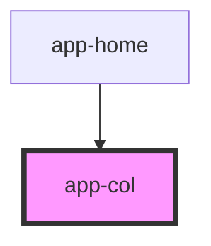

# app-col

<!-- Auto Generated Below -->

## Properties

| Property   | Attribute   | Description                                                                                              | Type      | Default     |
| ---------- | ----------- | -------------------------------------------------------------------------------------------------------- | --------- | ----------- |
| `audio`    | `audio`     | Audio file URL or identifier for sound that will be associated with the column.                          | `string`  | `undefined` |
| `bgColor`  | `bg-color`  | The background color of the column (CSS color value, e.g., '#FFFFFF', 'blue').                           | `string`  | `undefined` |
| `height`   | `height`    | The height of the column component (CSS value, e.g., '100px', '50%').                                    | `string`  | `undefined` |
| `id`       | `id`        | The unique identifier for the column component.                                                          | `string`  | `undefined` |
| `onEntry`  | `on-entry`  | Event handler for when the column is entered, which can be used to initiate specific behaviors on entry. | `string`  | `undefined` |
| `onMatch`  | `on-match`  | Event handler for a matching action, which can be used to hide the column or trigger other custom logic. | `string`  | `undefined` |
| `onTouch`  | `on-touch`  | Event handler for a touch event, where a custom function can be triggered when the column is touched.    | `string`  | `undefined` |
| `tabIndex` | `tab-index` | The tab index value, used to set the tab order of the column for keyboard navigation.                    | `number`  | `undefined` |
| `type`     | `type`      | Defines the type of the column, which can be used for styling or specific logic handling.                | `string`  | `undefined` |
| `value`    | `value`     | The value associated with the column component. Typically used for internal logic.                       | `string`  | `undefined` |
| `visible`  | `visible`   | A boolean that controls whether the column is visible (`true`) or hidden (`false`).                      | `boolean` | `undefined` |
| `width`    | `width`     | The width of the column component (CSS value, e.g., '100px', '50%').                                     | `string`  | `undefined` |
| `x`        | `x`         | The x-coordinate (left position) of the column within its container (CSS value, e.g., '10px', '5vw').    | `string`  | `undefined` |
| `y`        | `y`         | The y-coordinate (top position) of the column within its container (CSS value, e.g., '10px', '5vh').     | `string`  | `undefined` |
| `z`        | `z`         | The z-index of the column to control stacking order.                                                     | `string`  | `undefined` |

## Dependencies

### Used by

 - [app-home](../home)

### Graph

----------------------------------------------

*Built with [StencilJS](https://stenciljs.com/)*
