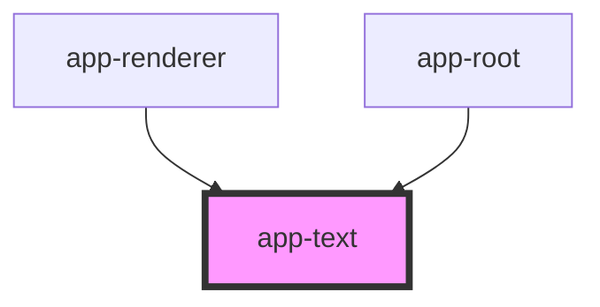

# app-text

<!-- Auto Generated Below -->

## Properties

| Property                 | Attribute                  | Description | Type      | Default     |
| ------------------------ | -------------------------- | ----------- | --------- | ----------- |
| `audio`                  | `audio`                    |             | `string`  | `undefined` |
| `bgColor`                | `bg-color`                 |             | `string`  | `undefined` |
| `font`                   | `font`                     |             | `string`  | `undefined` |
| `fontSize`               | `font-size`                |             | `string`  | `undefined` |
| `height`                 | `height`                   |             | `string`  | `undefined` |
| `highlightWhileSpeaking` | `highlight-while-speaking` |             | `boolean` | `undefined` |
| `id`                     | `id`                       |             | `string`  | `undefined` |
| `onEntry`                | `on-entry`                 |             | `string`  | `undefined` |
| `onMatch`                | `on-match`                 |             | `string`  | `undefined` |
| `onTouch`                | `on-touch`                 |             | `string`  | `undefined` |
| `string`                 | `string`                   |             | `string`  | `undefined` |
| `type`                   | `type`                     |             | `string`  | `undefined` |
| `value`                  | `value`                    |             | `string`  | `undefined` |
| `visible`                | `visible`                  |             | `boolean` | `undefined` |
| `width`                  | `width`                    |             | `string`  | `undefined` |
| `x`                      | `x`                        |             | `string`  | `undefined` |
| `y`                      | `y`                        |             | `string`  | `undefined` |

## Dependencies

### Used by

 - [app-renderer](.)
 - [app-root](.)

### Graph

----------------------------------------------

*Built with [StencilJS](https://stenciljs.com/)*
