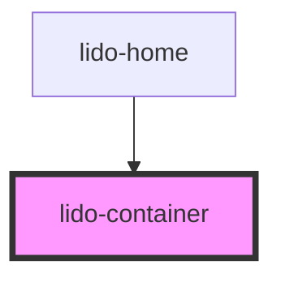

# app-container

<!-- Auto Generated Below -->

## Properties

| Property              | Attribute                | Description                                                                                                                                       | Type      | Default     |
| --------------------- | ------------------------ | ------------------------------------------------------------------------------------------------------------------------------------------------- | --------- | ----------- |
| `ariaHidden`          | `aria-hidden`            | The ARIA hidden attribute of the container. Used for accessibility to hide the element.                                                           | `string`  | `undefined` |
| `ariaLabel`           | `aria-label`             | The ARIA label of the container. Used for accessibility to indicate the purpose of the element.                                                   | `string`  | `undefined` |
| `audio`               | `audio`                  | URL or identifier of an audio file associated with the container.                                                                                 | `string`  | `undefined` |
| `baseUrl`             | `base-url`               | Base URL for the container.                                                                                                                       | `string`  | `''`        |
| `bgColor`             | `bg-color`               | Background color of the container (CSS color value).                                                                                              | `string`  | `undefined` |
| `canplay`             | `canplay`                | Boolean that controls the playability of the game.                                                                                                | `boolean` | `true`      |
| `height`              | `height`                 | The height of the container (CSS value).                                                                                                          | `string`  | `undefined` |
| `id`                  | `id`                     | Unique identifier for the container.                                                                                                              | `string`  | `undefined` |
| `isAllowOnlyCorrect`  | `is-allow-only-correct`  | Determines if the activity should proceed automatically only after a correct response. Acceptable values: "true" or "false". Defaults to "false". | `boolean` | `false`     |
| `isContinueOnCorrect` | `is-continue-on-correct` | Specifies whether the activity should continue automatically upon a correct response. Expected values: "true" or "false".                         | `boolean` | `false`     |
| `objective`           | `objective`              | Objective or purpose of the container. Can be used for internal logic or tracking.                                                                | `string`  | `undefined` |
| `onCorrect`           | `on-correct`             | Event handler for a Correct matching action, which can be used to hide the column or trigger other custom logic.                                  | `string`  | `undefined` |
| `onEntry`             | `on-entry`               | Event handler triggered when the container is entered, useful for triggering animations or logic.                                                 | `string`  | `undefined` |
| `onInCorrect`         | `on-in-correct`          | Event handler for an Incorrect matching action, which can be used to trigger custom logic when the action is incorrect.                           | `string`  | `undefined` |
| `onTouch`             | `on-touch`               | Event handler triggered when the container is touched or clicked.                                                                                 | `string`  | `undefined` |
| `showCheck`           | `show-check`             | Indicates whether the "Check" button should be visible or not. Expected values: "true" or "false".                                                | `boolean` | `false`     |
| `tabIndex`            | `tab-index`              | TabIndex for keyboard navigation.                                                                                                                 | `number`  | `undefined` |
| `type`                | `type`                   | Type of the container, which can be used for conditional logic or styling purposes.                                                               | `string`  | `undefined` |
| `value`               | `value`                  | Value assigned to the container. This can be used for logic related to this component.                                                            | `string`  | `undefined` |
| `visible`             | `visible`                | Visibility flag for the container. If `true`, the container is visible; otherwise, it is hidden.                                                  | `boolean` | `undefined` |
| `width`               | `width`                  | The width of the container (CSS value).                                                                                                           | `string`  | `undefined` |
| `x`                   | `x`                      | X-axis (horizontal) position of the container.                                                                                                    | `string`  | `undefined` |
| `y`                   | `y`                      | Y-axis (vertical) position of the container.                                                                                                      | `string`  | `undefined` |
| `z`                   | `z`                      | Z-index to control the stacking order of the container.                                                                                           | `string`  | `undefined` |

## Dependencies

### Used by

 - [lido-home](../home)

### Graph

----------------------------------------------

*Built with [StencilJS](https://stenciljs.com/)*
