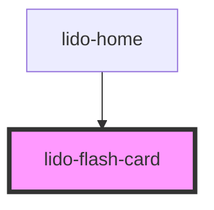

# lido-flash-card

<!-- Auto Generated Below -->

## Properties

| Property       | Attribute       | Description                                                                                                                                                              | Type      | Default     |
| -------------- | --------------- | ------------------------------------------------------------------------------------------------------------------------------------------------------------------------ | --------- | ----------- |
| `ariaHidden`   | `aria-hidden`   | The ARIA hidden attribute of the container. Used for accessibility to hide the element.                                                                                  | `string`  | `''`        |
| `ariaLabel`    | `aria-label`    | The ARIA label of the container. Used for accessibility to indicate the purpose of the element.                                                                          | `string`  | `''`        |
| `audio`        | `audio`         | Audio file URL or identifier for sound that will be associated with the column.                                                                                          | `string`  | `''`        |
| `back`         | `back`          | Content (any markup) shown on the back face.                                                                                                                             | `any`     | `undefined` |
| `bgColor`      | `bg-color`      | Background color of the column (CSS color value, e.g., '#FFFFFF', 'blue').                                                                                               | `string`  | `''`        |
| `delayVisible` | `delay-visible` | Delay in milliseconds to make the cell visible after mount.                                                                                                              | `string`  | `''`        |
| `direction`    | `direction`     | The number of child elements that should be displayed inside the row. This value is dynamically adjusted based on `minLength` and `maxLength`.                           | `string`  | `undefined` |
| `disableSpeak` | `disable-speak` | When set to true, disables the speak functionality of long press for this component and its children.                                                                    | `boolean` | `false`     |
| `display`      | `display`       | The Display CSS property.                                                                                                                                                | `string`  | `undefined` |
| `flipped`      | `flipped`       | Whether the card is flipped (back side visible). `mutable` lets the component toggle itself on click; `reflect` keeps the `<lido-flash-card flipped>` attribute in sync. | `boolean` | `false`     |
| `front`        | `front`         | Content (any markup) shown on the front face.                                                                                                                            | `any`     | `undefined` |
| `height`       | `height`        | The height of the column component (CSS value, e.g., '100px', '50%').                                                                                                    | `string`  | `'auto'`    |
| `margin`       | `margin`        | CSS margin value applied to each child element inside the container. Accepts standard CSS margin formats (e.g., '10px', '5px 10px', etc.).                               | `string`  | `''`        |
| `onCorrect`    | `on-correct`    | Event handler for a Correct matching action, which can be used to hide the column or trigger other custom logic.                                                         | `string`  | `''`        |
| `onEntry`      | `on-entry`      | Event handler triggered when the column is entered, useful for triggering animations or logic.                                                                           | `string`  | `''`        |
| `onInCorrect`  | `on-in-correct` | Event handler for an Incorrect matching action, which can be used to trigger custom logic when the action is incorrect.                                                  | `string`  | `''`        |
| `onTouch`      | `on-touch`      | Event handler for a touch event, where a custom function can be triggered when the column is touched.                                                                    | `string`  | `''`        |
| `tabIndex`     | `tab-index`     | Tab index for keyboard navigation.                                                                                                                                       | `number`  | `0`         |
| `type`         | `type`          | Defines the type of the column, which can be used for styling or specific logic handling.                                                                                | `string`  | `''`        |
| `value`        | `value`         | The value associated with the column component. Typically used for internal logic.                                                                                       | `string`  | `''`        |
| `visible`      | `visible`       | A boolean that controls whether the column is visible (`true`) or hidden (`false`).                                                                                      | `boolean` | `true`      |
| `width`        | `width`         | The width of the column component (CSS value, e.g., '100px', '50%').                                                                                                     | `string`  | `'auto'`    |
| `x`            | `x`             | X-axis (horizontal) position of the column within its container (CSS value, e.g., '10px', '5%').                                                                         | `string`  | `'0px'`     |
| `y`            | `y`             | Y-axis (vertical) position of the column within its container (CSS value, e.g., '10px', '5%').                                                                           | `string`  | `'0px'`     |
| `z`            | `z`             | Z-index for stacking order of the column relative to other elements.                                                                                                     | `string`  | `'0'`       |

## Dependencies

### Used by

 - [lido-home](../home)

### Graph

----------------------------------------------

*Built with [StencilJS](https://stenciljs.com/)*
