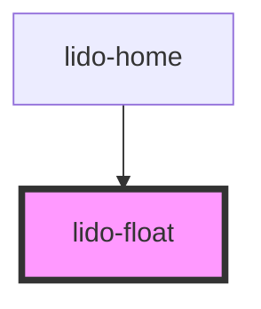

# lido-float

<!-- Auto Generated Below -->

## Properties

| Property   | Attribute   | Description                                                                                             | Type      | Default     |
| ---------- | ----------- | ------------------------------------------------------------------------------------------------------- | --------- | ----------- |
| `bgColor`  | `bg-color`  | The background color of the float element (CSS color value, e.g., '#FFFFFF', 'blue').                   | `string`  | `undefined` |
| `height`   | `height`    | The height of the float element (CSS value, e.g., '100px', '50%').                                      | `string`  | `undefined` |
| `id`       | `id`        | Unique identifier for the text element.                                                                 | `string`  | `''`        |
| `onEntry`  | `on-entry`  | Event handler triggered when the text component is entered (useful for animations or logic on entry).   | `string`  | `''`        |
| `tabIndex` | `tab-index` | Tab index for keyboard navigation.                                                                      | `number`  | `0`         |
| `value`    | `value`     | Value associated with the text element, typically used for internal logic or tracking.                  | `string`  | `''`        |
| `visible`  | `visible`   | Controls the visibility of the text component. If `true`, the text is visible; otherwise, it is hidden. | `boolean` | `false`     |
| `width`    | `width`     | The width of the float element (CSS value, e.g., '100px', '50%').                                       | `string`  | `undefined` |
| `z`        | `z`         | Z-index for stacking order of the text component relative to other elements.                            | `string`  | `'0'`       |

## Dependencies

### Used by

 - [lido-home](../home)

### Graph

----------------------------------------------

*Built with [StencilJS](https://stenciljs.com/)*
