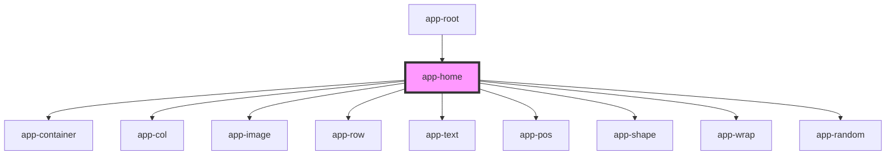

# app-home

<!-- Auto Generated Below -->

## Properties

| Property  | Attribute  | Description                                                                              | Type     | Default     |
| --------- | ---------- | ---------------------------------------------------------------------------------------- | -------- | ----------- |
| `xmlData` | `xml-data` | XML data passed to the component, which is parsed and used to render various containers. | `string` | `undefined` |

## Dependencies

### Used by

 - [app-root](../root)

### Depends on

- [app-container](../container)
- [app-col](../column)
- [app-image](../image)
- [app-row](../row)
- [app-text](../text)
- [app-pos](../position)
- [app-shape](../shape)
- [app-wrap](../wrap)
- [app-random](../random)

### Graph

----------------------------------------------

*Built with [StencilJS](https://stenciljs.com/)*
