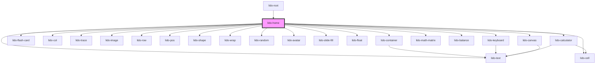

# app-home

<!-- Auto Generated Below -->

## Properties

| Property                 | Attribute            | Description                                                                                              | Type       | Default                  |
| ------------------------ | -------------------- | -------------------------------------------------------------------------------------------------------- | ---------- | ------------------------ |
| `Lang`                   | `lang`               | Language to apply to all texts                                                                           | `string`   | `''`                     |
| `activeContainerIndexes` | --                   | Array of active container indexes to be rendered                                                         | `number[]` | `[]`                     |
| `avatarUrl`              | `avatar-url`         | URL for the avatar Rive file.                                                                            | `string`   | `undefined`              |
| `baseUrl`                | `base-url`           | Base URL for the containers.                                                                             | `string`   | `''`                     |
| `canplay`                | `canplay`            | Boolean that controls the playability of the game.                                                       | `boolean`  | `true`                   |
| `commonAudioPath`        | `common-audio-path`  |                                                                                                          | `string`   | `""`                     |
| `exitButtonUrl`          | `exit-button-url`    | Custom URL for the Exit button icon. Falls back to the default icon if not provided or invalid.          | `string`   | `undefined`              |
| `height`                 | `height`             | The height of the container (CSS value).                                                                 | `string`   | `''`                     |
| `initialIndex`           | `initial-index`      | Initial index of the container being displayed.                                                          | `number`   | `0`                      |
| `nextButtonUrl`          | `next-button-url`    | Custom URL for the Next button icon. Falls back to the default icon if not provided or invalid.          | `string`   | `undefined`              |
| `prevButtonUrl`          | `prev-button-url`    | Custom URL for the Previous button icon. Falls back to the default icon if not provided or invalid.      | `string`   | `undefined`              |
| `showNav`                | `show-nav`           | Boolean to show or hide navigation buttons                                                               | `boolean`  | `true`                   |
| `speakerButtonUrl`       | `speaker-button-url` | Custom URL for the Speaker button icon. Falls back to the default icon if not provided or invalid.       | `string`   | `undefined`              |
| `uuid`                   | `uuid`               | Unique identifier for the component instance. If not provided, a UUID is generated to ensure uniqueness. | `string`   | `generateUUIDFallback()` |
| `xmlData`                | `xml-data`           | XML data passed to the component, which is parsed and used to render various containers.                 | `string`   | `''`                     |

## Dependencies

### Used by

 - [lido-root](../root)

### Depends on

- [lido-container](../container)
- [lido-flash-card](../flashCard)
- [lido-col](../column)
- [lido-trace](../trace)
- [lido-image](../image)
- [lido-row](../row)
- [lido-text](../text)
- [lido-pos](../position)
- [lido-shape](../shape)
- [lido-wrap](../wrap)
- [lido-random](../random)
- [lido-avatar](../avatar)
- [lido-cell](../cell)
- [lido-slide-fill](../slideFill)
- [lido-float](../float)
- [lido-keyboard](../keyboard)
- [lido-math-matrix](../mathMatrix)
- [lido-balance](../scale)
- [lido-calculator](../calculator)
- [lido-canvas](../canvas)

### Graph

----------------------------------------------

*Built with [StencilJS](https://stenciljs.com/)*
