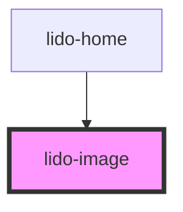

# app-image

<!-- Auto Generated Below -->

## Properties

| Property        | Attribute         | Description                                                                                                                                  | Type                | Default     |
| --------------- | ----------------- | -------------------------------------------------------------------------------------------------------------------------------------------- | ------------------- | ----------- |
| `ariaHidden`    | `aria-hidden`     | The ARIA hidden attribute of the container. Used for accessibility to hide the element.                                                      | `string`            | `undefined` |
| `ariaLabel`     | `aria-label`      | The ARIA label of the container. Used for accessibility to indicate the purpose of the element.                                              | `string`            | `undefined` |
| `audio`         | `audio`           | URL or identifier of an audio file associated with the image.                                                                                | `string`            | `undefined` |
| `bgColor`       | `bg-color`        | Background color for the container of the image (CSS color value, e.g., '#FFFFFF', 'blue').                                                  | `string`            | `undefined` |
| `borderRadius`  | `border-radius`   | CSS filter to apply border radius to the image. Example: '10px' for  images.                                                                 | `string`            | `'0px'`     |
| `filter`        | `filter`          | CSS filter to apply visual effects (e.g., blur, brightness) to the image. Example: 'blur(5px)', 'brightness(0.8)', 'grayscale(100%)'         | `string`            | `''`        |
| `height`        | `height`          | The height of the image component (CSS value, e.g., '100px', '50%').                                                                         | `string`            | `undefined` |
| `id`            | `id`              | Unique identifier for the text element.                                                                                                      | `string`            | `undefined` |
| `isSlice`       | `is-slice`        | Enables border-image slice support when true; otherwise, behaves as a regular image component                                                | `string`            | `undefined` |
| `margin`        | `margin`          | CSS margin value applied to each child element inside the container. Accepts standard CSS margin formats (e.g., '10px', '5px 10px', etc.).   | `string`            | `''`        |
| `maxDrops`      | `max-drops`       | The Maximum number of drag elements that can be dropped inside the Drop element.                                                             | `number`            | `1`         |
| `minDrops`      | `min-drops`       | The minimum number of drag elements that must be dropped inside the Drop element.                                                            | `number`            | `1`         |
| `onCorrect`     | `on-correct`      | Event handler for a Correct matching action, which can be used to hide the column or trigger other custom logic.                             | `string`            | `undefined` |
| `onEntry`       | `on-entry`        | Event handler triggered when the image is entered (useful for animations or logic on entry).                                                 | `string`            | `undefined` |
| `onInCorrect`   | `on-in-correct`   | Event handler for an Incorrect matching action, which can be used to trigger custom logic when the action is incorrect.                      | `string`            | `undefined` |
| `onTouch`       | `on-touch`        | Event handler triggered when the image is touched or clicked.                                                                                | `string`            | `undefined` |
| `padding`       | `padding`         | CSS padding value applied to each child element inside the container. Accepts standard CSS padding formats (e.g., '10px', '5px 10px', etc.). | `string`            | `''`        |
| `showSpeakIcon` | `show-speak-icon` | Controls whether the speak icon should appear directly on the top right corner of targeted element if it is true.                            | `boolean`           | `false`     |
| `sliceWidth`    | `slice-width`     | Specifies the width for border-image slice (e.g., "30px", "2em"). Only used when `isSlice` is enabled.                                       | `string`            | `'30px'`    |
| `src`           | `src`             | The source URL of the image to be displayed.                                                                                                 | `string`            | `undefined` |
| `tabIndex`      | `tab-index`       | Tab index for keyboard navigation.                                                                                                           | `number`            | `undefined` |
| `transform`     | `transform`       | CSS transform property to apply transformations like rotate, scale, translate, etc. Example: 'rotate(45deg)' or 'scale(1.2)'.                | `string`            | `''`        |
| `type`          | `type`            | Defines the type of the image component, which can be used for conditional logic or styling purposes.                                        | `string`            | `undefined` |
| `value`         | `value`           | The value associated with the image. Typically used for internal logic or identification.                                                    | `string`            | `undefined` |
| `visible`       | `visible`         | Controls the visibility of the image component. If `true`, the image is visible; otherwise, it is hidden.                                    | `boolean \| string` | `undefined` |
| `width`         | `width`           | The width of the image component (CSS value, e.g., '100px', '50%').                                                                          | `string`            | `undefined` |
| `x`             | `x`               | X-axis (horizontal) position of the image within its container (CSS value, e.g., '10px', '5vw').                                             | `string`            | `undefined` |
| `y`             | `y`               | Y-axis (vertical) position of the image within its container (CSS value, e.g., '10px', '5vh').                                               | `string`            | `undefined` |
| `z`             | `z`               | Z-index for stacking order of the image relative to other elements.                                                                          | `string`            | `undefined` |

## Dependencies

### Used by

 - [lido-home](../home)

### Graph

----------------------------------------------

*Built with [StencilJS](https://stenciljs.com/)*
