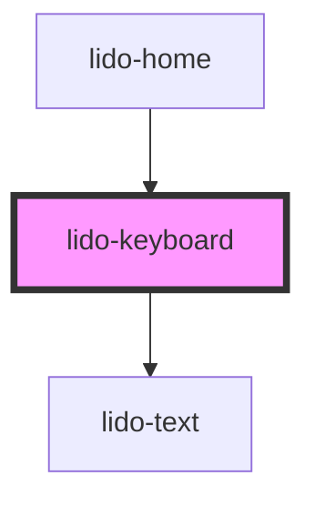

# lido-keyboard

<!-- Auto Generated Below -->

## Properties

| Property        | Attribute        | Description                                                                                                         | Type      | Default     |
| --------------- | ---------------- | ------------------------------------------------------------------------------------------------------------------- | --------- | ----------- |
| `columns`       | `columns`        | Number of columns in the keyboard layout                                                                            | `number`  | `10`        |
| `fontColor`     | `font-color`     | Font color for key labels (e.g., "#333")                                                                            | `string`  | `undefined` |
| `fontFamily`    | `font-family`    | Font family for key labels (e.g., "Arial, sans-serif")                                                              | `string`  | `undefined` |
| `fontSize`      | `font-size`      | Font size for key labels (e.g., "16px")                                                                             | `string`  | `undefined` |
| `gap`           | `gap`            |                                                                                                                     | `string`  | `'10px'`    |
| `height`        | `height`         | Height of each key button (e.g., "40px")                                                                            | `string`  | `undefined` |
| `keyboardInput` | `keyboard-input` | Indicates whether the keyboard input is enabled. When set to `true`, the component will respond to keyboard events. | `boolean` | `false`     |
| `keys`          | `keys`           | Comma-separated list of keys, optionally with status (e.g., "A,B-disable,C")                                        | `string`  | `''`        |
| `onEntry`       | `on-entry`       | Callback function when a key is entered                                                                             | `string`  | `undefined` |
| `type`          | `type`           | Type of the key (can be used for custom logic or styling)                                                           | `string`  | `undefined` |
| `width`         | `width`          | Width of each key button (e.g., "40px")                                                                             | `string`  | `undefined` |

## Dependencies

### Used by

 - [lido-home](../home)

### Depends on

- [lido-text](../text)

### Graph

----------------------------------------------

*Built with [StencilJS](https://stenciljs.com/)*
