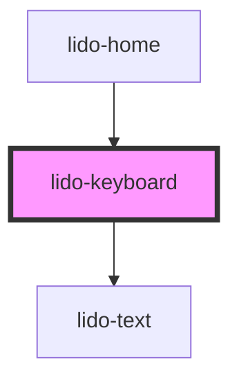

# lido-keyboard

<!-- Auto Generated Below -->

## Properties

| Property        | Attribute        | Description                                                                                                         | Type      | Default     |
| --------------- | ---------------- | ------------------------------------------------------------------------------------------------------------------- | --------- | ----------- |
| `bgColor`       | `bg-color`       | Background color for each key button                                                                                | `string`  | `''`        |
| `borderRadius`  | `border-radius`  | Border radius for key buttons (e.g., "8px")                                                                         | `string`  | `''`        |
| `columns`       | `columns`        | Number of columns in the keyboard layout (default: "10")                                                            | `string`  | `'10'`      |
| `disableSpeak`  | `disable-speak`  | When set to true, disables the speak functionality of long press for this component and its children.               | `boolean` | `false`     |
| `fontColor`     | `font-color`     | Font color for key labels (e.g., "#333")                                                                            | `string`  | `undefined` |
| `fontFamily`    | `font-family`    | Font family for key labels (e.g., "Arial, sans-serif")                                                              | `string`  | `undefined` |
| `fontSize`      | `font-size`      | Font size for key labels (e.g., "16px")                                                                             | `string`  | `undefined` |
| `gap`           | `gap`            | Gap between key buttons (default: "10px")                                                                           | `string`  | `'10px'`    |
| `height`        | `height`         | Height of each key button (e.g., "40px")                                                                            | `string`  | `undefined` |
| `keyboardInput` | `keyboard-input` | Indicates whether the keyboard input is enabled. When set to `true`, the component will respond to keyboard events. | `boolean` | `false`     |
| `keys`          | `keys`           | Comma-separated list of keys, optionally with status (e.g., "A,B-disable,C")                                        | `string`  | `''`        |
| `letterLength`  | `letter-length`  | Total number of letters required for completion                                                                     | `number`  | `undefined` |
| `margin`        | `margin`         | Margin around the keyboard container                                                                                | `string`  | `undefined` |
| `onEntry`       | `on-entry`       | Custom callback function when a key is entered                                                                      | `string`  | `undefined` |
| `padding`       | `padding`        | Padding inside the keyboard container                                                                               | `string`  | `undefined` |
| `type`          | `type`           | Type of key interaction (e.g., "click", "drag")                                                                     | `string`  | `undefined` |
| `visible`       | `visible`        | Whether the keyboard is visible ("true" / "false")                                                                  | `string`  | `undefined` |
| `width`         | `width`          | Width of each key button (e.g., "40px")                                                                             | `string`  | `undefined` |
| `x`             | `x`              | X position (left) of the keyboard                                                                                   | `string`  | `undefined` |
| `y`             | `y`              | Y position (top) of the keyboard                                                                                    | `string`  | `undefined` |
| `z`             | `z`              | Z-index for stacking order                                                                                          | `string`  | `undefined` |

## Dependencies

### Used by

 - [lido-home](../home)

### Depends on

- [lido-text](../text)

### Graph

----------------------------------------------

*Built with [StencilJS](https://stenciljs.com/)*
