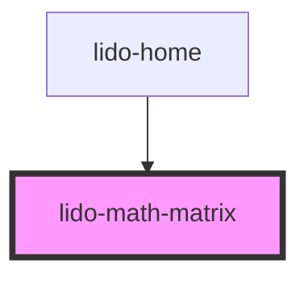

# lido-math-matrix

<!-- Auto Generated Below -->

## Properties

| Property            | Attribute             | Description                                                                 | Type      | Default             |
| ------------------- | --------------------- | --------------------------------------------------------------------------- | --------- | ------------------- |
| `activeBgColor`     | `active-bg-color`     | Background color for active slots                                           | `string`  | `'transparent'`     |
| `activeOnlyVisible` | `active-only-visible` | If true, only active slots are visible; inactive ones are hidden            | `boolean` | `false`             |
| `border`            | `border`              | Border style applied to each slot                                           | `string`  | `'2px solid green'` |
| `borderRadius`      | `border-radius`       | Border radius for each slot                                                 | `string`  | `'5px'`             |
| `bottomIndex`       | `bottom-index`        | Show row index numbers on the bottom side                                   | `boolean` | `false`             |
| `clickable`         | `clickable`           | Enable/disable click interactions on the slots                              | `boolean` | `true`              |
| `cols`              | `cols`                | Number of columns in the matrix                                             | `string`  | `"5"`               |
| `deactiveBgColor`   | `deactive-bg-color`   | Background color for inactive slots                                         | `string`  | `'transparent'`     |
| `defualtFill`       | `defualt-fill`        | Number of slots to pre-fill as active by default                            | `number`  | `0`                 |
| `fontColor`         | `font-color`          | Font color for the slot text                                                | `string`  | `undefined`         |
| `height`            | `height`              | Height of the slot container                                                | `string`  | `'100%'`            |
| `leftIndex`         | `left-index`          | Show row index numbers on the left side                                     | `boolean` | `false`             |
| `margin`            | `margin`              | Margin around the matrix container                                          | `string`  | `undefined`         |
| `matrixImage`       | `matrix-image`        | Image source used inside the slots                                          | `string`  | `undefined`         |
| `padding`           | `padding`             | Padding inside the matrix container                                         | `string`  | `undefined`         |
| `rows`              | `rows`                | Number of rows in the matrix                                                | `string`  | `"7"`               |
| `tabIndex`          | `tab-index`           | Sets the tab index for keyboard navigation                                  | `number`  | `undefined`         |
| `text`              | `text`                | The display text or label associated with this matrix element               | `string`  | `undefined`         |
| `topIndex`          | `top-index`           | Show column index numbers on the top side                                   | `boolean` | `false`             |
| `type`              | `type`                | Defines the matrix type (e.g., "drop", "slot", "answer")                    | `string`  | `undefined`         |
| `value`             | `value`               | The value or data associated with this matrix element                       | `string`  | `undefined`         |
| `visible`           | `visible`             | Controls the visibility of the matrix (accepts "true" or "false" as string) | `string`  | `'false'`           |
| `width`             | `width`               | Width of the slot container                                                 | `string`  | `'100%'`            |
| `x`                 | `x`                   | The left coordinate (in pixels or percentage) for matrix positioning        | `string`  | `undefined`         |
| `y`                 | `y`                   | The top coordinate (in pixels or percentage) for matrix positioning         | `string`  | `undefined`         |
| `z`                 | `z`                   | Z-index value for the matrix container                                      | `string`  | `undefined`         |

## Dependencies

### Used by

 - [lido-home](../home)

### Graph

----------------------------------------------

*Built with [StencilJS](https://stenciljs.com/)*
