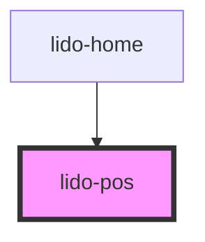

# app-pos

<!-- Auto Generated Below -->

## Properties

| Property      | Attribute       | Description                                                                                                             | Type                | Default  |
| ------------- | --------------- | ----------------------------------------------------------------------------------------------------------------------- | ------------------- | -------- |
| `ariaHidden`  | `aria-hidden`   | The ARIA hidden attribute of the container. Used for accessibility to hide the element.                                 | `string`            | `''`     |
| `ariaLabel`   | `aria-label`    | The ARIA label of the container. Used for accessibility to indicate the purpose of the element.                         | `string`            | `''`     |
| `audio`       | `audio`         | URL or identifier for an audio file associated with the component.                                                      | `string`            | `''`     |
| `bgColor`     | `bg-color`      | Background color of the component (CSS color value, e.g., '#FFFFFF', 'blue').                                           | `string`            | `''`     |
| `height`      | `height`        | The height of the component (CSS value, e.g., '100px', '50%').                                                          | `string`            | `'auto'` |
| `id`          | `id`            | Unique identifier for the positional element.                                                                           | `string`            | `''`     |
| `margin`      | `margin`        |                                                                                                                         | `string`            | `''`     |
| `maxDrops`    | `max-drops`     | The Maximum number of drag elements that can be dropped inside the Drop element.                                        | `number`            | `1`      |
| `minDrops`    | `min-drops`     | The minimum number of drag elements that must be dropped inside the Drop element.                                       | `number`            | `1`      |
| `onCorrect`   | `on-correct`    | Event handler for a Correct matching action, which can be used to hide the column or trigger other custom logic.        | `string`            | `''`     |
| `onEntry`     | `on-entry`      | Event handler triggered when the component is entered, often used to trigger animations or custom logic.                | `string`            | `''`     |
| `onInCorrect` | `on-in-correct` | Event handler for an Incorrect matching action, which can be used to trigger custom logic when the action is incorrect. | `string`            | `''`     |
| `onTouch`     | `on-touch`      | Event handler triggered when the component is touched or clicked.                                                       | `string`            | `''`     |
| `tabIndex`    | `tab-index`     | Tab index to support keyboard navigation within the component.                                                          | `number`            | `0`      |
| `type`        | `type`          | The type of the component, used for conditional logic or specific styles.                                               | `string`            | `''`     |
| `value`       | `value`         | Value assigned to the component, often used for internal logic or data tracking.                                        | `string`            | `''`     |
| `visible`     | `visible`       | Visibility flag to control whether the element is displayed (`true`) or hidden (`false`).                               | `boolean \| string` | `false`  |
| `width`       | `width`         | The width of the component (CSS value, e.g., '100px', '50%').                                                           | `string`            | `'auto'` |
| `x`           | `x`             | X-axis (horizontal) position of the component (CSS value, e.g., '10px', '5vw').                                         | `string`            | `'0px'`  |
| `y`           | `y`             | Y-axis (vertical) position of the component (CSS value, e.g., '10px', '5vh').                                           | `string`            | `'0px'`  |
| `z`           | `z`             | Z-index for stacking order of the element relative to others.                                                           | `string`            | `'0'`    |

## Dependencies

### Used by

 - [lido-home](../home)

### Graph

----------------------------------------------

*Built with [StencilJS](https://stenciljs.com/)*
