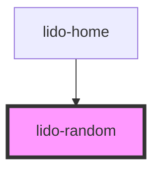

# app-random

<!-- Auto Generated Below -->

## Properties

| Property      | Attribute       | Description                                                                                                             | Type      | Default     |
| ------------- | --------------- | ----------------------------------------------------------------------------------------------------------------------- | --------- | ----------- |
| `ariaHidden`  | `aria-hidden`   | The ARIA hidden attribute of the container. Used for accessibility to hide the element.                                 | `string`  | `undefined` |
| `ariaLabel`   | `aria-label`    | The ARIA label of the container. Used for accessibility to indicate the purpose of the element.                         | `string`  | `undefined` |
| `audio`       | `audio`         | URL or identifier for an audio file associated with the component.                                                      | `string`  | `undefined` |
| `bgColor`     | `bg-color`      | Background color of the container (CSS color value, e.g., '#FFFFFF', 'blue').                                           | `string`  | `undefined` |
| `height`      | `height`        | The height of the container (CSS value, e.g., '100px', '50%').                                                          | `string`  | `undefined` |
| `id`          | `id`            | Unique identifier for the random container.                                                                             | `string`  | `undefined` |
| `onCorrect`   | `on-correct`    | Event handler for a Correct matching action, which can be used to hide the column or trigger other custom logic.        | `string`  | `undefined` |
| `onEntry`     | `on-entry`      | Event handler triggered when the component is entered (useful for animations or logic on entry).                        | `string`  | `undefined` |
| `onInCorrect` | `on-in-correct` | Event handler for an Incorrect matching action, which can be used to trigger custom logic when the action is incorrect. | `string`  | `undefined` |
| `onTouch`     | `on-touch`      | Event handler triggered when the component is touched or clicked.                                                       | `string`  | `undefined` |
| `tabIndex`    | `tab-index`     | Tab index for keyboard navigation.                                                                                      | `number`  | `undefined` |
| `type`        | `type`          | The type of the component, used for conditional logic or specific styling.                                              | `string`  | `undefined` |
| `value`       | `value`         | Value associated with the component, often used for internal logic.                                                     | `string`  | `undefined` |
| `visible`     | `visible`       | Controls the visibility of the container. If `true`, the container is visible; otherwise, it is hidden.                 | `boolean` | `undefined` |
| `width`       | `width`         | The width of the container (CSS value, e.g., '100px', '50%').                                                           | `string`  | `undefined` |
| `x`           | `x`             | X-axis (horizontal) position of the container (CSS value, e.g., '10px', '5vw').                                         | `string`  | `undefined` |
| `y`           | `y`             | Y-axis (vertical) position of the container (CSS value, e.g., '10px', '5vh').                                           | `string`  | `undefined` |
| `z`           | `z`             | Z-index for stacking order of the container relative to other elements.                                                 | `string`  | `undefined` |

## Dependencies

### Used by

 - [lido-home](../home)

### Graph

----------------------------------------------

*Built with [StencilJS](https://stenciljs.com/)*
