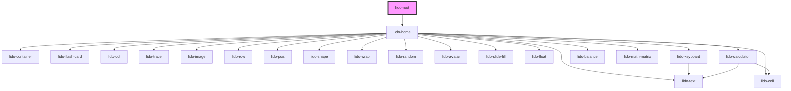

# app-root

<!-- Auto Generated Below -->

## Properties

| Property           | Attribute            | Description                                                                                                                                | Type      | Default     |
| ------------------ | -------------------- | ------------------------------------------------------------------------------------------------------------------------------------------ | --------- | ----------- |
| `baseUrl`          | `base-url`           | Base URL for the containers.                                                                                                               | `string`  | `''`        |
| `canplay`          | `canplay`            | Boolean that controls the playability of the game.                                                                                         | `boolean` | `true`      |
| `exitButtonUrl`    | `exit-button-url`    | Custom URL for the Exit button icon. Falls back to the default icon if not provided or invalid.                                            | `string`  | `undefined` |
| `initialIndex`     | `initial-index`      | Initial index of the container being displayed.                                                                                            | `number`  | `0`         |
| `margin`           | `margin`             | CSS margin value applied to each child element inside the container. Accepts standard CSS margin formats (e.g., '10px', '5px 10px', etc.). | `string`  | `''`        |
| `nextButtonUrl`    | `next-button-url`    | Custom URL for the Next button icon. Falls back to the default icon if not provided or invalid.                                            | `string`  | `undefined` |
| `prevButtonUrl`    | `prev-button-url`    | Custom URL for the Previous button icon. Falls back to the default icon if not provided or invalid.                                        | `string`  | `undefined` |
| `speakerButtonUrl` | `speaker-button-url` | Custom URL for the Speaker button icon. Falls back to the default icon if not provided or invalid.                                         | `string`  | `undefined` |
| `xmlPath`          | `xml-path`           | Prop to hold the XML file path or URL. This can be a relative path or an external URL.                                                     | `string`  | `''`        |

## Dependencies

### Depends on

- [lido-home](../home)

### Graph

----------------------------------------------

*Built with [StencilJS](https://stenciljs.com/)*
