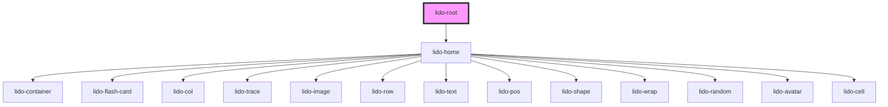

# app-root

<!-- Auto Generated Below -->

## Properties

| Property       | Attribute       | Description                                                                            | Type      | Default |
| -------------- | --------------- | -------------------------------------------------------------------------------------- | --------- | ------- |
| `baseUrl`      | `base-url`      | Base URL for the containers.                                                           | `string`  | `''`    |
| `canplay`      | `canplay`       | Boolean that controls the playability of the game.                                     | `boolean` | `true`  |
| `initialIndex` | `initial-index` | Initial index of the container being displayed.                                        | `number`  | `0`     |
| `xmlPath`      | `xml-path`      | Prop to hold the XML file path or URL. This can be a relative path or an external URL. | `string`  | `''`    |

## Dependencies

### Depends on

- [lido-home](../home)

### Graph

----------------------------------------------

*Built with [StencilJS](https://stenciljs.com/)*
