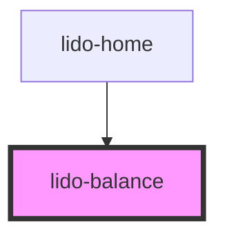

# lido-scale

<!-- Auto Generated Below -->

## Properties

| Property        | Attribute        | Description | Type                | Default                                                                                                             |
| --------------- | ---------------- | ----------- | ------------------- | ------------------------------------------------------------------------------------------------------------------- |
| `balanceSymbol` | `balance-symbol` |             | `string`            | `'='`                                                                                                               |
| `fill`          | `fill`           |             | `string`            | `'brown'`                                                                                                           |
| `handlerimage`  | `handlerimage`   |             | `string`            | `'https://aeakbcdznktpsbrfsgys.supabase.co/storage/v1/object/public/template-assets/balancing/Stands.svg'`          |
| `height`        | `height`         |             | `string`            | `'auto'`                                                                                                            |
| `margin`        | `margin`         |             | `string`            | `''`                                                                                                                |
| `maxTilt`       | `max-tilt`       |             | `number`            | `8`                                                                                                                 |
| `onEntry`       | `on-entry`       |             | `string`            | `''`                                                                                                                |
| `operation`     | `operation`      |             | `string`            | `'count'`                                                                                                           |
| `padding`       | `padding`        |             | `string`            | `''`                                                                                                                |
| `pivotimage`    | `pivotimage`     |             | `string`            | `'https://aeakbcdznktpsbrfsgys.supabase.co/storage/v1/object/public/template-assets/balancing/Display%20stand.svg'` |
| `scaleimage`    | `scaleimage`     |             | `string`            | `'https://aeakbcdznktpsbrfsgys.supabase.co/storage/v1/object/public/template-assets/balancing/Bar.svg'`             |
| `showSymbol`    | `show-symbol`    |             | `boolean`           | `false`                                                                                                             |
| `tilt`          | `tilt`           |             | `number`            | `0`                                                                                                                 |
| `visible`       | `visible`        |             | `boolean \| string` | `false`                                                                                                             |
| `width`         | `width`          |             | `string`            | `'auto'`                                                                                                            |
| `x`             | `x`              |             | `string`            | `'0px'`                                                                                                             |
| `y`             | `y`              |             | `string`            | `'0px'`                                                                                                             |
| `z`             | `z`              |             | `string`            | `'0'`                                                                                                               |

## Methods

### `hideSymbol() => Promise<void>`

#### Returns

Type: `Promise<void>`

### `revealSymbol() => Promise<void>`

#### Returns

Type: `Promise<void>`

### `updateTilt(leftVal: number, rightVal: number) => Promise<void>`

#### Parameters

| Name       | Type     | Description |
| ---------- | -------- | ----------- |
| `leftVal`  | `number` |             |
| `rightVal` | `number` |             |

#### Returns

Type: `Promise<void>`

## Dependencies

### Used by

 - [lido-home](../home)

### Graph

----------------------------------------------

*Built with [StencilJS](https://stenciljs.com/)*
