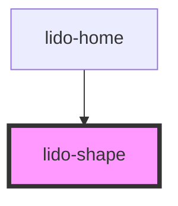

# app-shape

<!-- Auto Generated Below -->

## Properties

| Property      | Attribute       | Description                                                                                                             | Type      | Default    |
| ------------- | --------------- | ----------------------------------------------------------------------------------------------------------------------- | --------- | ---------- |
| `ariaHidden`  | `aria-hidden`   | The ARIA hidden attribute of the container. Used for accessibility to hide the element.                                 | `string`  | `''`       |
| `ariaLabel`   | `aria-label`    | The ARIA label of the container. Used for accessibility to indicate the purpose of the element.                         | `string`  | `''`       |
| `audio`       | `audio`         | URL or identifier for an audio file associated with the shape.                                                          | `string`  | `''`       |
| `bgColor`     | `bg-color`      | Background color of the shape (CSS color value, e.g., '#FFFFFF', 'blue'). This is ignored for polygons.                 | `string`  | `''`       |
| `height`      | `height`        | The height of the shape (CSS value, e.g., '100px', '50%'). This is ignored for polygons.                                | `string`  | `'auto'`   |
| `id`          | `id`            | Unique identifier for the shape element.                                                                                | `string`  | `''`       |
| `margin`      | `margin`        |                                                                                                                         | `string`  | `''`       |
| `maxDrops`    | `max-drops`     | The Maximum number of drag elements that can be dropped inside the Drop element.                                        | `number`  | `1`        |
| `minDrops`    | `min-drops`     | The minimum number of drag elements that must be dropped inside the Drop element.                                       | `number`  | `1`        |
| `onCorrect`   | `on-correct`    | Event handler for a Correct matching action, which can be used to hide the column or trigger other custom logic.        | `string`  | `''`       |
| `onEntry`     | `on-entry`      | Event handler triggered when the shape is entered (useful for animations or logic on entry).                            | `string`  | `''`       |
| `onInCorrect` | `on-in-correct` | Event handler for an Incorrect matching action, which can be used to trigger custom logic when the action is incorrect. | `string`  | `''`       |
| `onTouch`     | `on-touch`      | Event handler triggered when the shape is touched or clicked.                                                           | `string`  | `''`       |
| `shapeType`   | `shape-type`    | Type of shape to render (e.g., 'circle', 'rectangle', 'polygon').                                                       | `string`  | `'circle'` |
| `tabIndex`    | `tab-index`     | Tab index for keyboard navigation.                                                                                      | `number`  | `0`        |
| `type`        | `type`          | Defines the type of the shape, which can be used for conditional logic or specific styling.                             | `string`  | `''`       |
| `value`       | `value`         | Value associated with the shape, typically used for internal logic or tracking.                                         | `string`  | `''`       |
| `visible`     | `visible`       | Controls the visibility of the shape. If `true`, the shape is visible; otherwise, it is hidden.                         | `boolean` | `false`    |
| `width`       | `width`         | The width of the shape (CSS value, e.g., '100px', '50%'). This is ignored for polygons.                                 | `string`  | `'auto'`   |
| `x`           | `x`             | X-axis (horizontal) position of the shape (CSS value, e.g., '10px', '5vw').                                             | `string`  | `'0px'`    |
| `y`           | `y`             | Y-axis (vertical) position of the shape (CSS value, e.g., '10px', '5vh').                                               | `string`  | `'0px'`    |
| `z`           | `z`             | Z-index for stacking order of the shape relative to other elements.                                                     | `string`  | `'0'`      |

## Dependencies

### Used by

 - [lido-home](../home)

### Graph

----------------------------------------------

*Built with [StencilJS](https://stenciljs.com/)*
