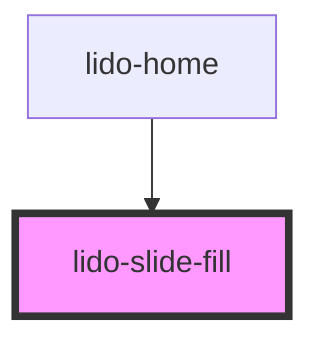

# lido-slide-fill

<!-- Auto Generated Below -->

## Properties

| Property        | Attribute        | Description                                                                                                                                  | Type                | Default             |
| --------------- | ---------------- | -------------------------------------------------------------------------------------------------------------------------------------------- | ------------------- | ------------------- |
| `bgColor`       | `bg-color`       | Background color for the container of the image (CSS color value, e.g., '#FFFFFF', 'blue').                                                  | `string`            | `undefined`         |
| `borderRadius`  | `border-radius`  | CSS filter to apply border radius to the image. Example: '10px' for  images.                                                                 | `string`            | `'0px'`             |
| `delayVisible`  | `delay-visible`  | Delay in milliseconds to make the cell visible after mount.                                                                                  | `string`            | `''`                |
| `disableSpeak`  | `disable-speak`  | When set to true, disables the speak functionality of long press for this component and its children.                                        | `boolean`           | `false`             |
| `division`      | `division`       | Number of divisions or segments to split the ruler path into                                                                                 | `number`            | `5`                 |
| `fill`          | `fill`           | Fill amount to display inside the SVG rect. Accepts values like "30%" or "30" (treated as percentage of fill)                                | `string`            | `undefined`         |
| `fillDirection` | `fill-direction` | Determines the direction in which the rect fill should grow: - 'vertical': from bottom to top - 'horizontal': from left to right             | `string`            | `undefined`         |
| `height`        | `height`         | CSS height of the component (e.g., "300px", "100%")                                                                                          | `string`            | `undefined`         |
| `id`            | `id`             | Unique identifier for the component instance                                                                                                 | `string`            | `'lido-slide-fill'` |
| `margin`        | `margin`         | CSS margin value applied to each child element inside the container. Accepts standard CSS margin formats (e.g., '10px', '5px 10px', etc.).   | `string`            | `undefined`         |
| `max`           | `max`            | Maximum value shown on the ruler (used for number generation)                                                                                | `number`            | `10`                |
| `min`           | `min`            | Minimum value shown on the ruler (used for number generation)                                                                                | `number`            | `0`                 |
| `numberType`    | `number-type`    | Type of number to be displayed on the ruler. Can be 'integer', 'decimal', or 'fraction'.                                                     | `string`            | `'integer'`         |
| `onEntry`       | `on-entry`       | Event handler triggered when the text component is entered (useful for animations or logic on entry).                                        | `string`            | `''`                |
| `padding`       | `padding`        | CSS padding value applied to each child element inside the container. Accepts standard CSS padding formats (e.g., '10px', '5px 10px', etc.). | `string`            | `''`                |
| `slider`        | `slider`         | Enables slider interaction (currently unused in logic, can be used to toggle slider UI)                                                      | `boolean`           | `undefined`         |
| `src`           | `src`            | URL or relative path to the external SVG file to be fetched and rendered                                                                     | `string`            | `undefined`         |
| `type`          | `type`           | Defines the type of the component, which can be used for conditional logic or specific styling.                                              | `string`            | `''`                |
| `visible`       | `visible`        | Controls the visibility of the image component. If `true`, the image is visible; otherwise, it is hidden.                                    | `boolean \| string` | `undefined`         |
| `width`         | `width`          | CSS width of the component (e.g., "300px", "100%")                                                                                           | `string`            | `undefined`         |
| `x`             | `x`              | X-axis (horizontal) position of the image within its container (CSS value, e.g., '10px', '5vw').                                             | `string`            | `undefined`         |
| `y`             | `y`              | Y-axis (vertical) position of the image within its container (CSS value, e.g., '10px', '5vh').                                               | `string`            | `undefined`         |
| `z`             | `z`              | Z-index for stacking order of the image relative to other elements.                                                                          | `string`            | `undefined`         |

## Dependencies

### Used by

 - [lido-home](../home)

### Graph

----------------------------------------------

*Built with [StencilJS](https://stenciljs.com/)*
