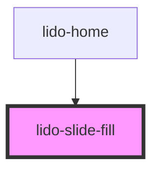

# lido-slider

<!-- Auto Generated Below -->

## Properties

| Property        | Attribute        | Description                                                                                                                      | Type      | Default             |
| --------------- | ---------------- | -------------------------------------------------------------------------------------------------------------------------------- | --------- | ------------------- |
| `division`      | `division`       | Number of divisions or segments to split the ruler path into                                                                     | `number`  | `5`                 |
| `fill`          | `fill`           | Fill amount to display inside the SVG rect. Accepts values like "30%" or "30" (treated as percentage of fill)                    | `string`  | `undefined`         |
| `fillDirection` | `fill-direction` | Determines the direction in which the rect fill should grow: - 'vertical': from bottom to top - 'horizontal': from left to right | `string`  | `undefined`         |
| `id`            | `id`             | Unique identifier for the component instance                                                                                     | `string`  | `'lido-slide-fill'` |
| `max`           | `max`            | Maximum value shown on the ruler (used for number generation)                                                                    | `number`  | `10`                |
| `min`           | `min`            | Minimum value shown on the ruler (used for number generation)                                                                    | `number`  | `0`                 |
| `numberType`    | `number-type`    | Type of number to be displayed on the ruler. Can be 'integer', 'decimal', or 'fraction'.                                         | `string`  | `'integer'`         |
| `slider`        | `slider`         | Enables slider interaction (currently unused in logic, can be used to toggle slider UI)                                          | `boolean` | `undefined`         |
| `src`           | `src`            | URL or relative path to the external SVG file to be fetched and rendered                                                         | `string`  | `undefined`         |
| `width`         | `width`          | CSS width of the component (e.g., "300px", "100%")                                                                               | `string`  | `undefined`         |

## Dependencies

### Used by

 - [lido-home](../home)

### Graph

----------------------------------------------

*Built with [StencilJS](https://stenciljs.com/)*
