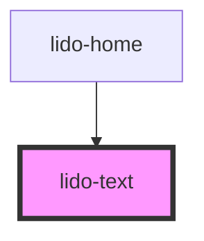

# app-text

<!-- Auto Generated Below -->

## Properties

| Property                 | Attribute                  | Description                                                                                                                                                                                                            | Type      | Default     |
| ------------------------ | -------------------------- | ---------------------------------------------------------------------------------------------------------------------------------------------------------------------------------------------------------------------- | --------- | ----------- |
| `ariaHidden`             | `aria-hidden`              | The ARIA hidden attribute of the container. Used for accessibility to hide the element.                                                                                                                                | `string`  | `undefined` |
| `ariaLabel`              | `aria-label`               | The ARIA label of the container. Used for accessibility to indicate the purpose of the element.                                                                                                                        | `string`  | `undefined` |
| `audio`                  | `audio`                    | URL or identifier for an audio file associated with the text component.                                                                                                                                                | `string`  | `undefined` |
| `bgColor`                | `bg-color`                 | Background color of the text component (CSS color value, e.g., '#FFFFFF', 'blue').                                                                                                                                     | `string`  | `undefined` |
| `font`                   | `font`                     | Font family for the text (CSS value, e.g., 'Arial', 'Times New Roman').                                                                                                                                                | `string`  | `undefined` |
| `fontColor`              | `font-color`               | Font color for the text (CSS color value, e.g., '#000000', 'red').                                                                                                                                                     | `string`  | `undefined` |
| `fontSize`               | `font-size`                | Font size for the text (CSS value, e.g., '16px', '1.5em').                                                                                                                                                             | `string`  | `undefined` |
| `height`                 | `height`                   | Height of the text component (CSS value, e.g., '100px', '50%').                                                                                                                                                        | `string`  | `undefined` |
| `highlightWhileSpeaking` | `highlight-while-speaking` | When set to `true`, the text will highlight while being spoken, typically used for accessibility.                                                                                                                      | `boolean` | `undefined` |
| `id`                     | `id`                       | Unique identifier for the text element.                                                                                                                                                                                | `string`  | `undefined` |
| `isAllowOnlyOneDrop`     | `is-allow-only-one-drop`   | Determines whether only a single draggable element is allowed to be dropped. If set to 'true', only one draggable element can be dropped in the drop zone. If set to 'false', multiple draggable elements are allowed. | `boolean` | `false`     |
| `onCorrect`              | `on-correct`               | Event handler for a Correct matching action, which can be used to hide the column or trigger other custom logic.                                                                                                       | `string`  | `undefined` |
| `onEntry`                | `on-entry`                 | Event handler triggered when the text component is entered (useful for animations or logic on entry).                                                                                                                  | `string`  | `undefined` |
| `onInCorrect`            | `on-in-correct`            | Event handler for an Incorrect matching action, which can be used to trigger custom logic when the action is incorrect.                                                                                                | `string`  | `undefined` |
| `onTouch`                | `on-touch`                 | Event handler triggered when the text component is touched or clicked.                                                                                                                                                 | `string`  | `undefined` |
| `string`                 | `string`                   | The string of text to be displayed in the component.                                                                                                                                                                   | `string`  | `undefined` |
| `tabIndex`               | `tab-index`                | Tab index for keyboard navigation.                                                                                                                                                                                     | `number`  | `undefined` |
| `type`                   | `type`                     | Defines the type of the component, which can be used for conditional logic or specific styling.                                                                                                                        | `string`  | `undefined` |
| `value`                  | `value`                    | Value associated with the text element, typically used for internal logic or tracking.                                                                                                                                 | `string`  | `undefined` |
| `visible`                | `visible`                  | Controls the visibility of the text component. If `true`, the text is visible; otherwise, it is hidden.                                                                                                                | `boolean` | `undefined` |
| `width`                  | `width`                    | Width of the text component (CSS value, e.g., '100px', '50%').                                                                                                                                                         | `string`  | `undefined` |
| `x`                      | `x`                        | X-axis (horizontal) position of the text component (CSS value, e.g., '10px', '5vw').                                                                                                                                   | `string`  | `undefined` |
| `y`                      | `y`                        | Y-axis (vertical) position of the text component (CSS value, e.g., '10px', '5vh').                                                                                                                                     | `string`  | `undefined` |
| `z`                      | `z`                        | Z-index for stacking order of the text component relative to other elements.                                                                                                                                           | `string`  | `undefined` |

## Dependencies

### Used by

 - [lido-home](../home)

### Graph

----------------------------------------------

*Built with [StencilJS](https://stenciljs.com/)*
