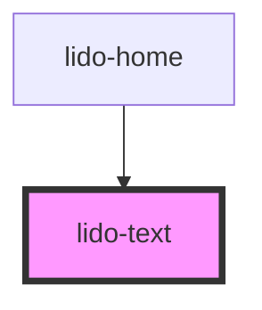

# app-text

<!-- Auto Generated Below -->

## Properties

| Property                 | Attribute                  | Description                                                                                                                                        | Type                         | Default  |
| ------------------------ | -------------------------- | -------------------------------------------------------------------------------------------------------------------------------------------------- | ---------------------------- | -------- |
| `ariaHidden`             | `aria-hidden`              | The ARIA hidden attribute of the container. Used for accessibility to hide the element.                                                            | `string`                     | `''`     |
| `ariaLabel`              | `aria-label`               | The ARIA label of the container. Used for accessibility to indicate the purpose of the element.                                                    | `string`                     | `''`     |
| `audio`                  | `audio`                    | URL or identifier for an audio file associated with the text component.                                                                            | `string`                     | `''`     |
| `bgColor`                | `bg-color`                 | Background color of the text component (CSS color value, e.g., '#FFFFFF', 'blue').                                                                 | `string`                     | `''`     |
| `borderImage`            | `border-image`             | The border image of the column (CSS border-image value, e.g., 'url(border.png)', 'linear-gradient(red, blue)').                                    | `string`                     | `''`     |
| `borderRadius`           | `border-radius`            | CSS filter to apply border radius to the image. Example: '10px' for  images.                                                                       | `string`                     | `'0px'`  |
| `delayVisible`           | `delay-visible`            | Delay in milliseconds to make the cell visible after mount.                                                                                        | `string`                     | `''`     |
| `fontColor`              | `font-color`               | Font color for the text (CSS color value, e.g., '#000000', 'red').                                                                                 | `string`                     | `''`     |
| `fontFamily`             | `font-family`              | Font family for the text (CSS value, e.g., 'Arial', 'Times New Roman').                                                                            | `string`                     | `''`     |
| `fontSize`               | `font-size`                | Font size for the text (CSS value, e.g., '16px', '1.5em').                                                                                         | `string`                     | `'20px'` |
| `height`                 | `height`                   | Height of the text component (CSS value, e.g., '100px', '50%').                                                                                    | `string`                     | `'auto'` |
| `highlightWhileSpeaking` | `highlight-while-speaking` | When set to `true`, the text will highlight while being spoken, typically used for accessibility.                                                  | `boolean`                    | `false`  |
| `id`                     | `id`                       | Unique identifier for the text element.                                                                                                            | `string`                     | `''`     |
| `margin`                 | `margin`                   | CSS margin value applied to each child element inside the container. Accepts standard CSS margin formats (e.g., '10px', '5px 10px', etc.).         | `string`                     | `''`     |
| `maxDrops`               | `max-drops`                | The Maximum number of drag elements that can be dropped inside the Drop element.                                                                   | `number`                     | `1`      |
| `minDrops`               | `min-drops`                | The minimum number of drag elements that must be dropped inside the Drop element.                                                                  | `number`                     | `1`      |
| `onCorrect`              | `on-correct`               | Event handler for a Correct matching action, which can be used to hide the column or trigger other custom logic.                                   | `string`                     | `''`     |
| `onEntry`                | `on-entry`                 | Event handler triggered when the text component is entered (useful for animations or logic on entry).                                              | `string`                     | `''`     |
| `onInCorrect`            | `on-in-correct`            | Event handler for an Incorrect matching action, which can be used to trigger custom logic when the action is incorrect.                            | `string`                     | `''`     |
| `onTouch`                | `on-touch`                 | Event handler triggered when the text component is touched or clicked.                                                                             | `string`                     | `''`     |
| `padding`                | `padding`                  | CSS padding value applied to each child element inside the container. Accepts standard CSS padding formats (e.g., '10px', '5px 10px', etc.).       | `string`                     | `''`     |
| `showSpeakIcon`          | `show-speak-icon`          | Controls whether the speak icon should appear directly on the top right corner of targeted element if it is true.                                  | `boolean`                    | `false`  |
| `spanType`               | `span-type`                | Indicates whether to wrap each letter or each word of the text in a span element. This can be useful for animations or styling individual letters. | `"" \| "letters" \| "words"` | `''`     |
| `string`                 | `string`                   | The string of text to be displayed in the component.                                                                                               | `string`                     | `''`     |
| `tabIndex`               | `tab-index`                | Tab index for keyboard navigation.                                                                                                                 | `number`                     | `0`      |
| `type`                   | `type`                     | Defines the type of the component, which can be used for conditional logic or specific styling.                                                    | `string`                     | `''`     |
| `value`                  | `value`                    | Value associated with the text element, typically used for internal logic or tracking.                                                             | `string`                     | `''`     |
| `visible`                | `visible`                  | Controls the visibility of the text component. If `true`, the text is visible; otherwise, it is hidden.                                            | `boolean \| string`          | `false`  |
| `width`                  | `width`                    | Width of the text component (CSS value, e.g., '100px', '50%').                                                                                     | `string`                     | `'auto'` |
| `x`                      | `x`                        | X-axis (horizontal) position of the text component (CSS value, e.g., '10px', '5vw').                                                               | `string`                     | `'0px'`  |
| `y`                      | `y`                        | Y-axis (vertical) position of the text component (CSS value, e.g., '10px', '5vh').                                                                 | `string`                     | `'0px'`  |
| `z`                      | `z`                        | Z-index for stacking order of the text component relative to other elements.                                                                       | `string`                     | `'0'`    |

## Dependencies

### Used by

 - [lido-home](../home)

### Graph

----------------------------------------------

*Built with [StencilJS](https://stenciljs.com/)*
