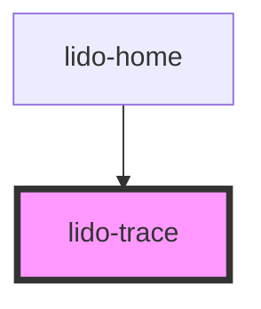

# app-trace

<!-- Auto Generated Below -->

## Properties

| Property        | Attribute         | Description                                                                                                                                                                             | Type     | Default                                                                                                |
| --------------- | ----------------- | --------------------------------------------------------------------------------------------------------------------------------------------------------------------------------------- | -------- | ------------------------------------------------------------------------------------------------------ |
| `ariaHidden`    | `aria-hidden`     | Controls visibility for assistive technologies. If `"true"`, the component is hidden from screen readers.                                                                               | `string` | `undefined`                                                                                            |
| `ariaLabel`     | `aria-label`      | Accessible label for screen readers, providing a textual description of the component's purpose.                                                                                        | `string` | `undefined`                                                                                            |
| `fingerHintUrl` | `finger-hint-url` | URL for the finger hint image                                                                                                                                                           | `string` | `'https://aeakbcdznktpsbrfsgys.supabase.co/storage/v1/object/public/template-assets/trace/finger.png'` |
| `height`        | `height`          | Specifies the height of the component container, accepts any valid CSS height value (e.g., `"100px"`, `"50%"`).                                                                         | `string` | `undefined`                                                                                            |
| `id`            | `id`              | Unique identifier for this `lido-trace` component instance.                                                                                                                             | `string` | `undefined`                                                                                            |
| `mode`          | `mode`            | Mode for the tracing interaction, defining how users interact with the SVG paths. Options may include `"noFlow"`, `"showFlow"`, `"freeTrace"`, `"blindTracing"`, and `"blindFreeTrace"` | `string` | `TraceMode.ShowFlow`                                                                                   |
| `svgSource`     | `svg-source`      | Source URL or path for the SVG file used in this component.                                                                                                                             | `string` | `undefined`                                                                                            |
| `tabIndex`      | `tab-index`       | Sets the tab order of the component within the page, enabling keyboard navigation.                                                                                                      | `number` | `undefined`                                                                                            |
| `value`         | `value`           | A custom string value associated with the component for additional data or identification.                                                                                              | `string` | `undefined`                                                                                            |
| `width`         | `width`           | Specifies the width of the component container, accepts any valid CSS width value (e.g., `"100px"`, `"50%"`).                                                                           | `string` | `undefined`                                                                                            |
| `x`             | `x`               | Defines the x-coordinate position (left offset) of the component container, using any valid CSS `left` value (e.g., `"10px"`, `"5%"`).                                                  | `string` | `undefined`                                                                                            |
| `y`             | `y`               | Defines the y-coordinate position (top offset) of the component container, using any valid CSS `top` value (e.g., `"10px"`, `"5%"`).                                                    | `string` | `undefined`                                                                                            |
| `z`             | `z`               | Sets the z-index of the component, controlling its stacking order on the page.                                                                                                          | `string` | `undefined`                                                                                            |

## Dependencies

### Used by

 - [lido-home](../home)

### Graph

----------------------------------------------

*Built with [StencilJS](https://stenciljs.com/)*
