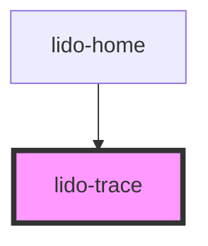

# app-trace

<!-- Auto Generated Below -->

## Properties

| Property          | Attribute           | Description                                                                                                                                                                             | Type      | Default                                                                                                |
| ----------------- | ------------------- | --------------------------------------------------------------------------------------------------------------------------------------------------------------------------------------- | --------- | ------------------------------------------------------------------------------------------------------ |
| `animationTrace`  | `animation-trace`   | Indicates whether to play an animation trace when the SVG is completed.                                                                                                                 | `boolean` | `false`                                                                                                |
| `ariaHidden`      | `aria-hidden`       | Controls visibility for assistive technologies. If `"true"`, the component is hidden from screen readers.                                                                               | `string`  | `''`                                                                                                   |
| `ariaLabel`       | `aria-label`        | Accessible label for screen readers, providing a textual description of the component's purpose.                                                                                        | `string`  | `''`                                                                                                   |
| `delayVisible`    | `delay-visible`     | Delay in milliseconds to make the cell visible after mount.                                                                                                                             | `string`  | `''`                                                                                                   |
| `fingerHintUrl`   | `finger-hint-url`   | URL for the finger hint image                                                                                                                                                           | `string`  | `'https://aeakbcdznktpsbrfsgys.supabase.co/storage/v1/object/public/template-assets/trace/finger.png'` |
| `height`          | `height`            | Specifies the height of the component container, accepts any valid CSS height value (e.g., `"100px"`, `"50%"`).                                                                         | `string`  | `'auto'`                                                                                               |
| `highlightTextId` | `highlight-text-id` | Indicates whether to highlight the text associated with the SVG when the trace is completed.                                                                                            | `string`  | `''`                                                                                                   |
| `id`              | `id`                | Unique identifier for this `lido-trace` component instance.                                                                                                                             | `string`  | `''`                                                                                                   |
| `mode`            | `mode`              | Mode for the tracing interaction, defining how users interact with the SVG paths. Options may include `"noFlow"`, `"showFlow"`, `"freeTrace"`, `"blindTracing"`, and `"blindFreeTrace"` | `string`  | `TraceMode.ShowFlow`                                                                                   |
| `onCorrect`       | `on-correct`        | Event handler for a Correct Trace, which can be used to hide the column or trigger other custom logic.                                                                                  | `string`  | `undefined`                                                                                            |
| `onInCorrect`     | `on-in-correct`     | Event handler for an Incorrect Trace, which can be used to trigger custom logic when the action is incorrect.                                                                           | `string`  | `undefined`                                                                                            |
| `showSpeakIcon`   | `show-speak-icon`   | Controls whether the speak icon should appear directly on the top right corner of targeted element.                                                                                     | `boolean` | `false`                                                                                                |
| `svgSource`       | `svg-source`        | Source URL or path for the SVG file used in this component.                                                                                                                             | `string`  | `''`                                                                                                   |
| `tabIndex`        | `tab-index`         | Sets the tab order of the component within the page, enabling keyboard navigation.                                                                                                      | `number`  | `0`                                                                                                    |
| `value`           | `value`             | A custom string value associated with the component for additional data or identification.                                                                                              | `string`  | `''`                                                                                                   |
| `width`           | `width`             | Specifies the width of the component container, accepts any valid CSS width value (e.g., `"100px"`, `"50%"`).                                                                           | `string`  | `'auto'`                                                                                               |
| `x`               | `x`                 | Defines the x-coordinate position (left offset) of the component container, using any valid CSS `left` value (e.g., `"10px"`, `"5%"`).                                                  | `string`  | `'0px'`                                                                                                |
| `y`               | `y`                 | Defines the y-coordinate position (top offset) of the component container, using any valid CSS `top` value (e.g., `"10px"`, `"5%"`).                                                    | `string`  | `'0px'`                                                                                                |
| `z`               | `z`                 | Sets the z-index of the component, controlling its stacking order on the page.                                                                                                          | `string`  | `'0'`                                                                                                  |

## Dependencies

### Used by

 - [lido-home](../home)

### Graph

----------------------------------------------

*Built with [StencilJS](https://stenciljs.com/)*
