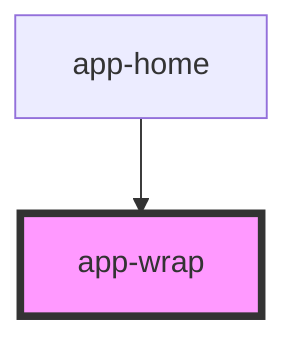

# app-wrap

<!-- Auto Generated Below -->

## Properties

| Property   | Attribute   | Description                                                                                                  | Type      | Default     |
| ---------- | ----------- | ------------------------------------------------------------------------------------------------------------ | --------- | ----------- |
| `audio`    | `audio`     | URL or identifier of an audio file associated with the wrap container.                                       | `string`  | `undefined` |
| `bgColor`  | `bg-color`  | Background color of the wrap container (CSS color value, e.g., '#FFFFFF', 'blue').                           | `string`  | `undefined` |
| `height`   | `height`    | The height of the wrap container (CSS value, e.g., '100px', '50%').                                          | `string`  | `undefined` |
| `id`       | `id`        | Unique identifier for the wrap element.                                                                      | `string`  | `undefined` |
| `onEntry`  | `on-entry`  | Event handler triggered when the wrap container is entered (useful for animations or logic on entry).        | `string`  | `undefined` |
| `onMatch`  | `on-match`  | Event handler triggered when a matching action occurs with the wrap container.                               | `string`  | `undefined` |
| `onTouch`  | `on-touch`  | Event handler triggered when the wrap container is touched or clicked.                                       | `string`  | `undefined` |
| `tabIndex` | `tab-index` | Tab index for keyboard navigation.                                                                           | `number`  | `undefined` |
| `type`     | `type`      | Defines the type of the wrap container, which can be used for conditional logic or specific styling.         | `string`  | `undefined` |
| `value`    | `value`     | Value associated with the wrap element, typically used for internal logic or tracking.                       | `string`  | `undefined` |
| `visible`  | `visible`   | Controls the visibility of the wrap container. If `true`, the container is visible; otherwise, it is hidden. | `boolean` | `undefined` |
| `width`    | `width`     | The width of the wrap container (CSS value, e.g., '100px', '50%').                                           | `string`  | `undefined` |
| `x`        | `x`         | X-axis (horizontal) position of the wrap container (CSS value, e.g., '10px', '5vw').                         | `string`  | `undefined` |
| `y`        | `y`         | Y-axis (vertical) position of the wrap container (CSS value, e.g., '10px', '5vh').                           | `string`  | `undefined` |
| `z`        | `z`         | Z-index for stacking order of the wrap container relative to other elements.                                 | `string`  | `undefined` |

## Dependencies

### Used by

 - [app-home](../home)

### Graph

----------------------------------------------

*Built with [StencilJS](https://stenciljs.com/)*
