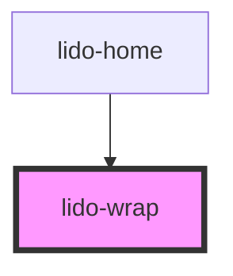

# app-wrap

<!-- Auto Generated Below -->

## Properties

| Property              | Attribute               | Description                                                                                                                                                                                                                                                                               | Type      | Default     |
| --------------------- | ----------------------- | ----------------------------------------------------------------------------------------------------------------------------------------------------------------------------------------------------------------------------------------------------------------------------------------- | --------- | ----------- |
| `ariaHidden`          | `aria-hidden`           | The ARIA hidden attribute of the container. Used for accessibility to hide the element.                                                                                                                                                                                                   | `string`  | `undefined` |
| `ariaLabel`           | `aria-label`            | The ARIA label of the container. Used for accessibility to indicate the purpose of the element.                                                                                                                                                                                           | `string`  | `undefined` |
| `audio`               | `audio`                 | URL or identifier of an audio file associated with the wrap container.                                                                                                                                                                                                                    | `string`  | `undefined` |
| `bgColor`             | `bg-color`              | Background color of the wrap container (CSS color value, e.g., '#FFFFFF', 'blue').                                                                                                                                                                                                        | `string`  | `undefined` |
| `childElementsLength` | `child-elements-length` | The number of child elements that should be displayed inside the row. This value is dynamically adjusted based on `minLength` and `maxLength`.                                                                                                                                            | `number`  | `undefined` |
| `flex`                | `flex`                  | Enables flex layout mode for the container. If set to `"true"`, the component will use a flex layout (`display: flex`) instead of the default grid layout (`display: grid`). Additionally, the `lido-wrap` class will be replaced with `lido-flex` to allow custom flex-specific styling. | `string`  | `undefined` |
| `height`              | `height`                | The height of the wrap container (CSS value, e.g., '100px', '50%').                                                                                                                                                                                                                       | `string`  | `undefined` |
| `id`                  | `id`                    | Unique identifier for the wrap element.                                                                                                                                                                                                                                                   | `string`  | `undefined` |
| `maxLength`           | `max-length`            | The maximum number of child elements that can be displayed inside the row. If `childElementsLength` exceeds this value, excess elements will be hidden.                                                                                                                                   | `number`  | `undefined` |
| `minLength`           | `min-length`            | The minimum number of child elements that must be displayed inside the row. If `childElementsLength` is less than this value, additional elements may be shown to meet this minimum.                                                                                                      | `number`  | `undefined` |
| `onCorrect`           | `on-correct`            | Event handler for a Correct matching action, which can be used to hide the column or trigger other custom logic.                                                                                                                                                                          | `string`  | `undefined` |
| `onEntry`             | `on-entry`              | Event handler triggered when the wrap container is entered (useful for animations or logic on entry).                                                                                                                                                                                     | `string`  | `undefined` |
| `onInCorrect`         | `on-in-correct`         | Event handler for an Incorrect matching action, which can be used to trigger custom logic when the action is incorrect.                                                                                                                                                                   | `string`  | `undefined` |
| `onTouch`             | `on-touch`              | Event handler triggered when the wrap container is touched or clicked.                                                                                                                                                                                                                    | `string`  | `undefined` |
| `tabIndex`            | `tab-index`             | Tab index for keyboard navigation.                                                                                                                                                                                                                                                        | `number`  | `undefined` |
| `type`                | `type`                  | Defines the type of the wrap container, which can be used for conditional logic or specific styling.                                                                                                                                                                                      | `string`  | `undefined` |
| `value`               | `value`                 | Value associated with the wrap element, typically used for internal logic or tracking.                                                                                                                                                                                                    | `string`  | `undefined` |
| `visible`             | `visible`               | Controls the visibility of the wrap container. If `true`, the container is visible; otherwise, it is hidden.                                                                                                                                                                              | `boolean` | `undefined` |
| `width`               | `width`                 | The width of the wrap container (CSS value, e.g., '100px', '50%').                                                                                                                                                                                                                        | `string`  | `undefined` |
| `x`                   | `x`                     | X-axis (horizontal) position of the wrap container (CSS value, e.g., '10px', '5vw').                                                                                                                                                                                                      | `string`  | `undefined` |
| `y`                   | `y`                     | Y-axis (vertical) position of the wrap container (CSS value, e.g., '10px', '5vh').                                                                                                                                                                                                        | `string`  | `undefined` |
| `z`                   | `z`                     | Z-index for stacking order of the wrap container relative to other elements.                                                                                                                                                                                                              | `string`  | `undefined` |

## Dependencies

### Used by

 - [lido-home](../home)

### Graph

----------------------------------------------

*Built with [StencilJS](https://stenciljs.com/)*
