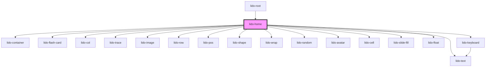

# app-home

<!-- Auto Generated Below -->

## Properties

| Property       | Attribute       | Description                                                                              | Type      | Default |
| -------------- | --------------- | ---------------------------------------------------------------------------------------- | --------- | ------- |
| `baseUrl`      | `base-url`      | Base URL for the containers.                                                             | `string`  | `''`    |
| `canplay`      | `canplay`       | Boolean that controls the playability of the game.                                       | `boolean` | `true`  |
| `height`       | `height`        | The height of the container (CSS value).                                                 | `string`  | `''`    |
| `initialIndex` | `initial-index` | Initial index of the container being displayed.                                          | `number`  | `0`     |
| `xmlData`      | `xml-data`      | XML data passed to the component, which is parsed and used to render various containers. | `string`  | `''`    |

## Dependencies

### Used by

 - [lido-root](../root)

### Depends on

- [lido-container](../container)
- [lido-flash-card](../flashCard)
- [lido-col](../column)
- [lido-trace](../trace)
- [lido-image](../image)
- [lido-row](../row)
- [lido-text](../text)
- [lido-pos](../position)
- [lido-shape](../shape)
- [lido-wrap](../wrap)
- [lido-random](../random)
- [lido-avatar](../avatar)
- [lido-cell](../cell)
- [lido-slide-fill](../slideFill)
- [lido-float](../float)
- [lido-keyboard](../keyboard)

### Graph

----------------------------------------------

*Built with [StencilJS](https://stenciljs.com/)*
